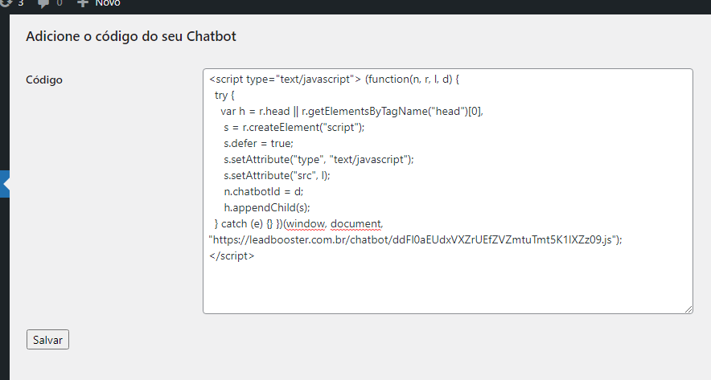

# LeadBooster Chatbot para Sites

**Contributors:** Hériton S. <lead@leadbooster.com.br>  
**Tags:** code, javascript, css, chatbot, leadbooster  
**Requires at least:** 5.0  
**Tested up to:** 6.3.1  
**Requires PHP:** 7.0  
**Stable tag:** 0.1  
**Version:** 0.1  
**License:** GPL-2.0+  
**License URI:** http://www.gnu.org/licenses/gpl-2.0.txt  

## Description

Add LeadBooster to the page head without editing the template.

## Installation

1. Upload the `your-plugin` directory to the `/wp-content/plugins/` directory, or use the WordPress plugin installer.
2. Activate the plugin through the 'Plugins' menu in WordPress.

## Screenshots

1. **Tela Principal do Plugin**:   
   First Screen of Leadbooster Plugin.

## Changelog

## 0.1
* Initial release of the plugin.

## Calling External JavaScript File ##

This plugin makes an external call to a JavaScript file to function properly. This is necessary to retrieve user-specific chatbot parameters.

The external call to the JavaScript file is done as follows:

- File Name: [IdForChatbot].js
- File URL: https://leadbooster.com.br/chatbot/[IdForChatbot].js

This practice is adopted to allow users to embed the chatbot on their website.

We understand the importance of keeping file calls local. However, in this case, it is essential for the proper functioning of the leadbooster application, and we provide this explanation for greater transparency.

If you have any questions or concerns about the external JavaScript file call, please contact us at suporte@leadbooster.com.br for more information.